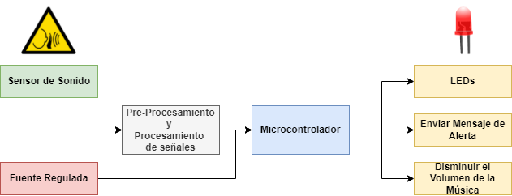

# Noise-Detector
Proyecto realizado para el curso de Laboratorio de Sistemas Digitales. 

# Overview
The repository includes everything needed to build an Noise Detector (excluding hardware):

- Arduino C++ code, which includes code for:
  - Sound level meter
  - Send messages via telegram
  - Lower the volume of a device

# What do I need to make one?
## Computer + Arduino + Sound sensor module + Wifi module

- EL SENSOR DE SONIDO KY-038 

- Arduino UNO

- Pantalla LCD 16x2
- Modulo I2C
- Arduino and the open-source Arduino Software (IDE)

