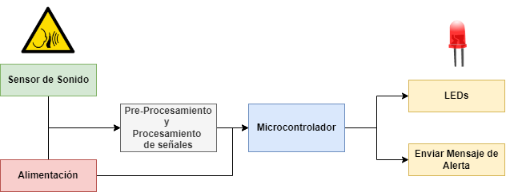
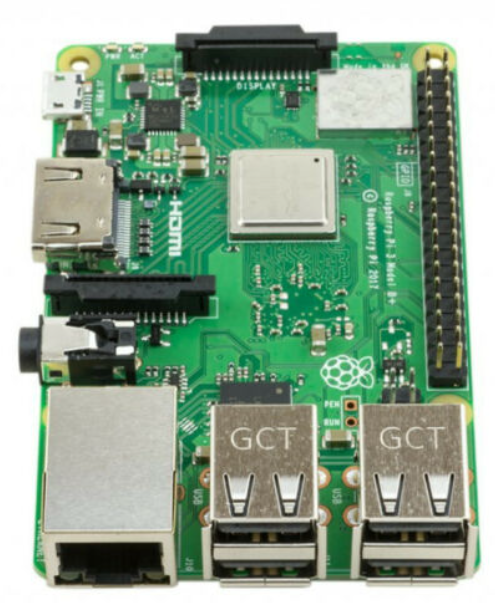
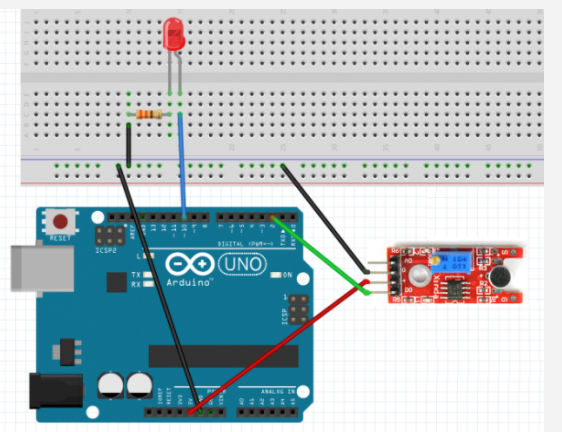
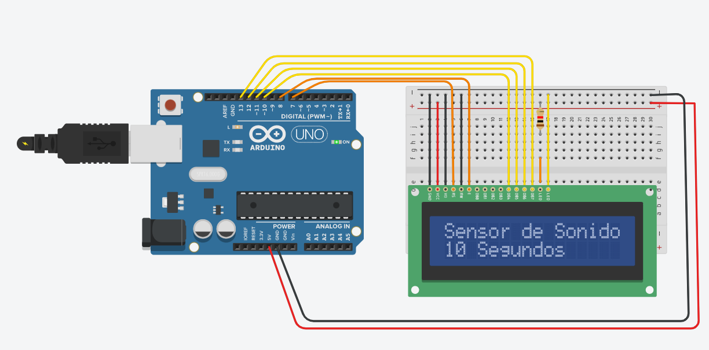
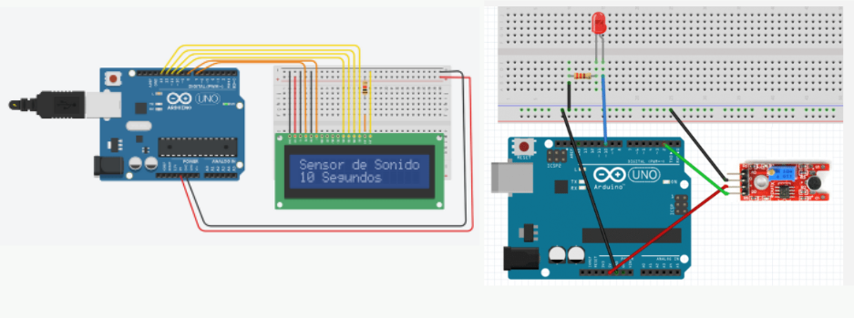
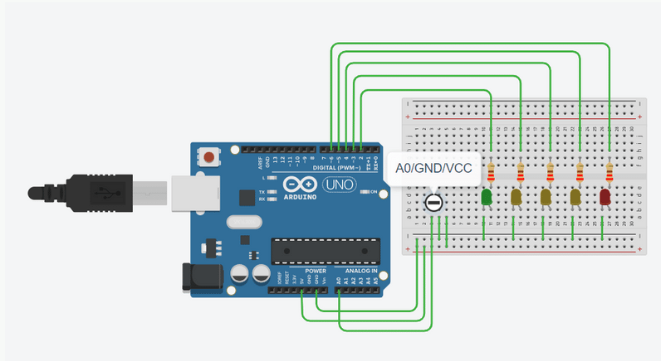
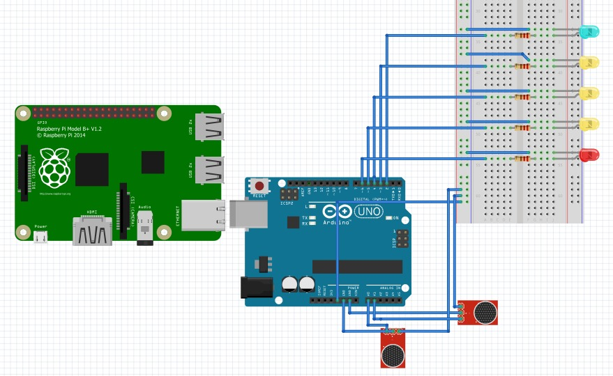
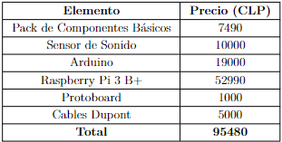

# Noise-Detector
Proyecto realizado para el curso de Laboratorio de Sistemas Digitales. 

# Overview
The repository includes everything needed to build an Noise Detector (excluding hardware):

- Arduino C++ code, which includes code for:
  - Sound level meter
  - Send messages via telegram

# What do I need to make one?
## Computer + Arduino + Sound sensor module + Wifi module or Computer + Arduino + Sound sensor module + Raspberry pi

- SOUND SENSOR KY-038 

- Arduino UNO

- Raspberry Pi 3 B+

## Module 1

## Module 2

## Module 3

## Module 4

## Module 5

## Final Circuit

## Economic Evaluation 

