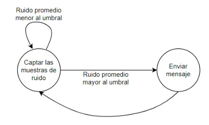

# Noise-Detector
Proyecto realizado para el curso de Laboratorio de Sistemas Digitales. 

**Profesor:** Helmuth Thiemer W.

**Integrantes:**
* Benjamin Irarrazabal 
* Joaquin Zepeda
## Antecedentes

Si bien en Chile no existen encuestas sobre la cantidad de multas por “ruidos molestos” se puede
estimar que no son menores, esto debido a la cultura de los ciudadanos y de que gran parte de la
población juvenil y en principios de la adultez realice fiestas con música a un alto volumen muchas
veces sin considerar a sus vecinos. Sin embargo, la definición de “ruido molesto” es subjetiva y por
este motivo el Ministerio del Medio Ambiente estableció los límites de decibeles ([dB]) máximos según
día y hora en el decreto 38, el cual “establece norma de emisión de ruidos generados por fuentes que
indica, elaborada a partir de la revisión del decreto número 146, de 1997, del Ministerio Secretaría
General de la República” [1]. Por otro lado, la OMS ha recomendado mantener niveles de ruido bajo
los 85[dB] para garantizar una buena salud y bienestar, el no cumplimiento de esto puede causar
pérdida de audición a largo plazo y en casos extremos (sobre 100[db] sin el debido cuidado, por
ejemplo, el uso de tapones o audífonos especiales) la pérdida auditiva inmediata

## Esquema del proyecto
El proyecto será dividido en cinco partes principales las cuales se pueden estudiar y trabajar
independientemente. La figura 4 resume estos puntos tomando distintos colores para identificar cada
una, primero, se trabajará en la implementación del sensor de sonido, con el cual se tomarán las
muestras necesarias que serán procesadas posteriormente en un microcontrolador (Arduino UNO y
Raspberry en este caso). Finalmente, se proyecta realizar los dos actuadores en amarillo, que darán
aviso al usuario y evitarán problemas con la administración y sus vecinos.

## Modularización funcional

# Overview
The repository includes everything needed to build an Noise Detector (excluding hardware):

- Arduino C++ code, which includes code for:
  - Sound level meter
  - Send messages via telegram

# What do I need to make one?
## Computer + Arduino + Sound sensor module + Wifi module or Computer + Arduino + Sound sensor module + Raspberry pi

- SOUND SENSOR KY-038 

- Arduino UNO

- Raspberry Pi 3 B+

## Module 1

## Module 2

## Module 3

 
Debido a problemas integrando el módulo Wifi, se utiliza una combinación entre el arduino y una raspberry pi para el proyecto, en donde el arduino funciona como conversor análogo digital y la raspberry envía los datos y activa los actuadores. (se recomienda ver la sección de cómo mejorar el proyecto pues si bien esto funciona, se puede realizar con un menor costo solo utilizando el arduino y otros módulos).

## Module 4

## Module 5

## Final Circuit

A continuación, se presenta el esquema de conexión para la integración final del circuito. Hay dos partes principales. Primero, la sección superior derecha, construida a base de LEDs, resistencias y un protoboard, toma las muestras de audio y enciende los LEDs según el nivel del volumen. Para esto, se debe configurar la sensibilidad de los potenciómetros de los sensores de sonido manualmente. Por otro lado, la segunda parte consiste en la Raspberry Pi, la cual mediante
un programa de Python y mediante una conexión WiFi, es capaz de enviar mensajes a través de un
bot de Telegram. Esto se realiza mediante la definición de un umbral dentro del código, sobre el cual
se detalla más adelante.

Importante destacar que existe una conexión serial entre la Raspberry Pi y el Arduino, el cual
tiene en sus entradas análogas dos sensores de sonido y en sus canales digitales las
LEDs de advertencia del módulo anterior.

### Funcionamiento del circuito

El funcionamiento del circuito se basa principalmente en el código de Python con el cual se configura la Raspberry Pi. En este, se define un promedio de muestras de ruido recibidas por parte de los dos sensores, el cual se procesa con el algoritmo creado y determina si el ruido está superando el umbral o no. Este funcionamiento se ve reflejado en el siguiente diagrama de estados.

Luego, la acción de los LEDs de advertencia es controlada mediante un código de Arduino, el cual recibe el promedio de los dos sensores y actúa según el nivel alcanzado. Debido a la simplicidad de los componentes, la calibración de sensibilidad se realizó de manera manual, apoyándose de una aplicación celular de sonómetro, no obstante, se cumple con el objetivo, logrando avisar oportunamente los ruidos peligrosos y fuera de norma (sobre 80 [dB]) en rojo y manteniéndose en azul o amarillo para niveles aceptables y sanos. \\

Finalmente, el punto más importante del funcionamiento del circuito corresponde a la definición del umbral, el cual controlará el envío del mensaje a través de Telegram. Como fue mencionado anteriormente, debido a la simplicidad de los sensores se utilizó el promedio de estos.

/2)

Luego, considerando que los sensores están configurados para tomar muestras cada $0.1$ segundos, se define la cantidad de muestras usadas para calcular el promedio con el cual actuará el circuito. En primera instancia, se toma un segundo promedio de 100 muestras, por lo tanto, el dispositivo analizará este valor cada 10 segundos y actuará debidamente según el diagrama de la figura \ref{Estados}. No obstante, lo anterior, fue realizado para comprobar el funcionamiento del proyecto ya que, para dejar establecido el dispositivo en un lugar fijo lo ideal es que se tome un promedio de una mayor cantidad de muestras, aumentando el tiempo que tarda este en actuar.

## Economic Evaluation 

Falta agregar las HH (horas hombre) que corresponden a  756000 CLP, el cálculo de HH se realizó considerando dos trabajadores, 9 jornadas correspondientes a los
laboratorios desde la semana 5 hasta la 14 y 3 horas de trabajo diario.

## Como mejorar el proyecto

Este proyecto podría mejorarse utilizando solamente el Arduino UNO y un módulo Wi-Fi ESP8266.
Esto reemplazaría a la Raspberry Pi y sería posible disminuir en forma significativa el precio del proyecto. Por otro lado, se podría mejorar el rendimiento del equipo reemplazando los sensores por unos
que tengan un mayor rango de detección, de todas maneras cambiar los sensores aumentaría el precio
del proyecto.
Finalmente, se podría diseñar una estructura para proteger la integridad del circuito y que sólo sean
visibles las partes importantes de este, por ejemplo, las entradas USB de la Raspberry, la entrada de
alimentación, los sensores, entre otros.

