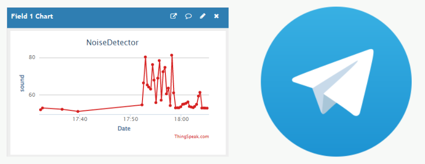

# Noise-Detector
Proyecto realizado para el curso de Laboratorio de Sistemas Digitales. 

**Profesor:** Helmuth Thiemer W.

**Integrantes:**
* Benjamin Irarrazabal 
* Joaquin Zepeda
## Antecedentes

Si bien en Chile no existen encuestas sobre la cantidad de multas por “ruidos molestos” se puede
estimar que no son menores, esto debido a la cultura de los ciudadanos y de que gran parte de la
población juvenil y en principios de la adultez realice fiestas con música a un alto volumen muchas
veces sin considerar a sus vecinos. Sin embargo, la definición de “ruido molesto” es subjetiva y por
este motivo el Ministerio del Medio Ambiente estableció los límites de decibeles ([dB]) máximos según
día y hora en el decreto 38, el cual “establece norma de emisión de ruidos generados por fuentes que
indica, elaborada a partir de la revisión del decreto número 146, de 1997, del Ministerio Secretaría
General de la República” [1]. Por otro lado, la OMS ha recomendado mantener niveles de ruido bajo
los 85[dB] para garantizar una buena salud y bienestar, el no cumplimiento de esto puede causar
pérdida de audición a largo plazo y en casos extremos (sobre 100[db] sin el debido cuidado, por
ejemplo, el uso de tapones o audífonos especiales) la pérdida auditiva inmediata

## Esquema del proyecto
El proyecto será dividido en cinco partes principales las cuales se pueden estudiar y trabajar
independientemente. La figura 4 resume estos puntos tomando distintos colores para identificar cada
una, primero, se trabajará en la implementación del sensor de sonido, con el cual se tomarán las
muestras necesarias que serán procesadas posteriormente en un microcontrolador (Arduino UNO y
Raspberry en este caso). Finalmente, se proyecta realizar los dos actuadores en amarillo, que darán
aviso al usuario y evitarán problemas con la administración y sus vecinos.

## Modularización funcional

# Overview
The repository includes everything needed to build an Noise Detector (excluding hardware):

- Arduino C++ code, which includes code for:
  - Sound level meter
  - Send messages via telegram

# What do I need to make one?
## Computer + Arduino + Sound sensor module + Wifi module or Computer + Arduino + Sound sensor module + Raspberry pi

- SOUND SENSOR KY-038 

- Arduino UNO

- Raspberry Pi 3 B+

## Module 1

## Module 2

## Module 3

 
Debido a problemas integrando el módulo Wifi, se utiliza una combinación entre el arduino y una raspberry pi para el proyecto, en donde el arduino funciona como conversor análogo digital y la raspberry envía los datos y activa los actuadores. (se recomienda ver la sección de cómo mejorar el proyecto pues si bien esto funciona, se puede realizar con un menor costo solo utilizando el arduino y otros módulos).

## Module 4

## Module 5

## Final Circuit

## Economic Evaluation 

Falta agregar las HH (horas hombre) que corresponden a  756000 CLP, el cálculo de HH se realizó considerando dos trabajadores, 9 jornadas correspondientes a los
laboratorios desde la semana 5 hasta la 14 y 3 horas de trabajo diario.

## Como mejorar el proyecto

Este proyecto podría mejorarse utilizando solamente el Arduino UNO y un módulo Wi-Fi ESP8266.
Esto reemplazaría a la Raspberry Pi y sería posible disminuir en forma significativa el precio del proyecto. Por otro lado, se podría mejorar el rendimiento del equipo reemplazando los sensores por unos
que tengan un mayor rango de detección, de todas maneras cambiar los sensores aumentaría el precio
del proyecto.
Finalmente, se podría diseñar una estructura para proteger la integridad del circuito y que sólo sean
visibles las partes importantes de este, por ejemplo, las entradas USB de la Raspberry, la entrada de
alimentación, los sensores, entre otros.

